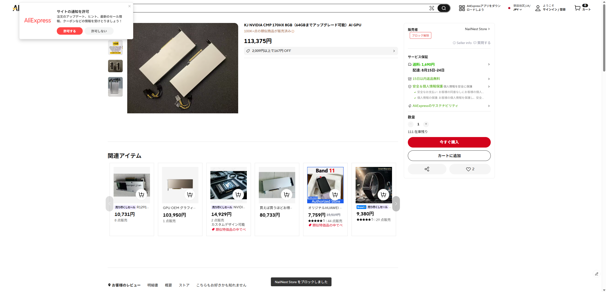
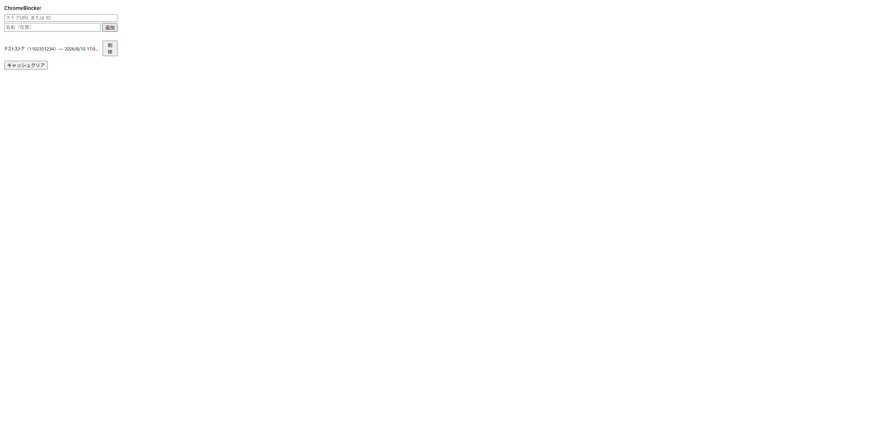
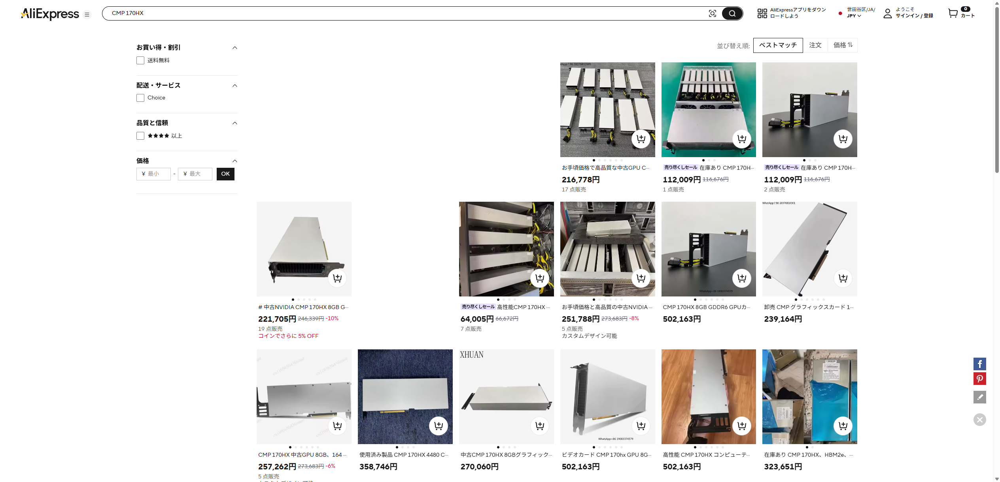

# Nope — 見たくないもの見せません

閲覧中の Web ページから、指定した発信元のコンテンツを非表示にする Chrome 拡張機能（Manifest V3）です。現在は AliExpress の特定ストアに対応しています。

気に入らないストア、悪質な出品者、模倣品ばかり並べてくるストアを一度ブロックすれば、以後は検索結果からもそのストアの商品が自動的に消えます。

## 機能

- **商品ページでワンクリックブロック**: 商品ページの販売者表示の隣に「🚫 このストアをブロック」ボタンが出ます。クリックするとそのストアをブラックリストに追加し、以後の判定に使います（再クリックでブロック解除も可能）。
- **検索結果から自動的に消える**: 検索結果一覧で、ブロック済みストアの商品カードを自動的に非表示にします。ブラックリストを更新すると、ページを再読み込みしなくてもその場で反映されます。
- **ブラックリスト管理画面**: ツールバーのアイコンから、ブロック中のストア一覧の確認・削除、ストアURLまたはIDを直接入力しての手動追加ができます。

## スクリーンショット

商品ページのブロックボタン（クリックでブロック、解除も可能）



ブラックリスト管理画面（ツールバーアイコンから開く）



検索結果ページ（ブロック済みストアの商品は表示されません）



## 導入手順

現時点では Chrome ウェブストアには未公開のため、開発者モードでの読み込み（Load unpacked）で導入します。ストア公開後はここにストアのリンクを追記します。

1. このリポジトリをダウンロードまたは `git clone` する
2. Chrome で `chrome://extensions` を開く
3. 右上の「デベロッパーモード」をオンにする
4. 「パッケージ化されていない拡張機能を読み込む」を選び、リポジトリのルートフォルダ（`manifest.json` があるフォルダ）を指定する
5. AliExpress の商品ページ・検索結果ページで動作します

## プライバシー

- **拡張独自の外部（第三者）サーバーへの送信は一切ありません。** 通信はブラウザが AliExpress のページを表示する際に行う通信（AliExpress 自身の API `acs.aliexpress.com` への、商品ID からストアIDを引くリクエストを含む）だけです。開発者や第三者が運営するサーバーへユーザーのデータを送ることはありません。
- **利用状況の収集・送信は行いません。** アクセス解析やトラッキングの類は組み込んでいません。
- **データの保存先は Chrome の `chrome.storage` のみです。**
  - ブラックリスト（ブロックしたストアの一覧）は `chrome.storage.sync` に保存され、ログイン中の Google アカウントで同期されます。
  - 商品ID→ストアIDの解決結果は、通信回数を減らすためのキャッシュとして `chrome.storage.local` に保存されます（端末内のみ、同期されません）。
- 拡張の権限は `storage` のみで、`host_permissions` は使用していません。

詳細は [プライバシーポリシー](docs/store/privacy.md) をご覧ください。

## 技術メモ

- Manifest V3。content script は AliExpress の全ドメイン（`*://*.aliexpress.com/*`）に対して動きます。
- 商品ページのストアID解決には AliExpress の内部API（`mtop.aliexpress.pdp.pc.query`、署名付きJSONP）を使っています。isolated world（通常の content script）と、`content_scripts[].world: "MAIN"` で宣言した中継スクリプト（`src/mtop-main-relay.js`）が `CustomEvent` でやり取りし、ページ本体のコンテキストで実際の JSONP リクエストを発行します。
- 検索結果ページでは、キャッシュ未ヒットのカードのみ上記のストアID解決を同時2件・間隔300msで実行し、結果をキャッシュへ保存します。
- 検索結果の増減（無限スクロール・SPA遷移）には `MutationObserver` で追従します。

## 開発・テスト

フレームワーク非依存の素の JavaScript です。

```
node --test test/
```

## ライセンス

[MIT License](LICENSE)
